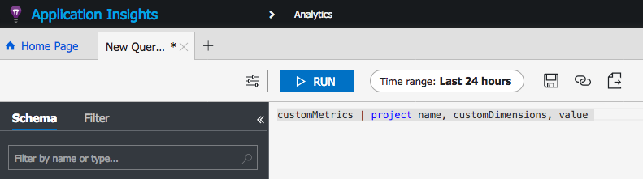
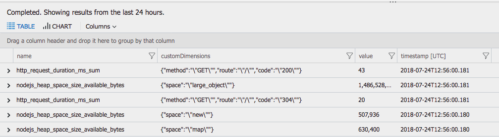

# Prometheus to Application Insights [](https://travis-ci.org/eladiw/prometheus_to_app_insights) [](https://coveralls.io/github/eladiw/prometheus_to_app_insights?branch=master)

This project provides automatic integration with Azure Application Insights without the need to do any instrumentation or code changes. Designed to work within a kubernetes cluster, altough can be run as a standalone process.
Just run this image and your metrics will reach your Application Insights service.

## Prerequisites
1. An HTTP endpoint with Prometheus style endpoints or a Prometheus server (with same exposed endpoints)
2. [Create an Application Insights resource](https://docs.microsoft.com/en-us/azure/application-insights/app-insights-create-new-resource)
3. [Copy the Instrumentation key](https://docs.microsoft.com/en-us/azure/application-insights/app-insights-create-new-resource#copy-the-instrumentation-key)

### Deploying and running in Kubernetes
1. Clone the git repository
2. Edit [yaml file](./deployment.yaml), add the AI instrumentation key and monitored http endpoint (APPINSIGHTS_INSTRUMENTATIONKEY and PROMETHEUS_URL)
3. Apply the yaml configuration
```bash
kubectl apply -f deployment.yaml 
```
note: to validate either check your application instance for the custom metrics (see below) or check the pod logs

### Running locally (without docker)
1. run:
```bash
export APPINSIGHTS_INSTRUMENTATIONKEY=<YOUR_APP_INSIGHTS_KEY>
export PROMETHEUS_URL=http://ip:port/metrics

npm install
npm start
```
where both values should be changed to the actual instrumentation key of your AI service and the prometheus http endpoint url.

### Building and running a docker container

1. Build the docker container with:
```bash
docker build -t ams0/prom-appinsights:0.1 . 
```
2. run it:
```bash
docker run --rm -e PROMETHEUS_URL="<url including /metrics>" -e APPINSIGHTS_INSTRUMENTATIONKEY="<key>" ams0/prom-appinsights:0.1
```

## Usage
After applying the yaml files, metrics are already flowing to Application Insights. Visit the [Application Insights Analytics page](https://docs.microsoft.com/en-us/azure/application-insights/app-insights-analytics) to find them. The schema used is 'customMetrics', see example below:



## Contributing

Feel free to fix any issue and contributing directly to the code base by creating a PR.